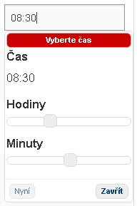

Nette-date-time
===============
[](https://travis-ci.org/venca-x/nette-date-time)
[](https://coveralls.io/github/venca-x/nette-date-time?branch=v1.1)
[](https://packagist.org/packages/venca-x/nette-date-time)
[](https://packagist.org/packages/venca-x/nette-date-time)
[](https://packagist.org/packages/venca-x/nette-date-time)
[](https://packagist.org/packages/venca-x/nette-date-time)

Nette addon form for select date or datetime in input.



Installation
------------
Install with composer:
```
composer require venca-x/nette-date-time:v1.1
```

Requirements
-------------
- **[PHP](https://php.net)** 7.1 or later
- **[nette/forms](https://github.com/nette/forms)** 3.0 or later
- **[nette/utils](https://github.com/nette/utils)** 3.0 or later
- **[jQuery](https://jquery.com)** 1.9.1 or later
- **[jQuery UI](https://jqueryui.com)** 1.10.2 or later (DatePicker and DateTimePicker only)

For Nette 2.3 use branch **v1.0**

Usage Sample
-------------

to bootstrap.php add register line OR add line in config.neon

```php
//$configurator->createRobotLoader()
//	->addDirectory(__DIR__)
    //	->addDirectory(__DIR__ . '/../libs')
    //	->register();

VencaX\NetteDateTime\NetteDateTimePicker::register();

// Create Dependency Injection container from config.neon file
```


Usage
-------------

```php
$form->addDate("name", "Label:", "type")
```
types:
* **datetime** - set date and time
* **date** - set date
* **month** - sem month (with year)
* **time** - set time (H:i)
* **timesec** - set time with sec (H:i:s)


presenter set value:
```php
protected function concertForm()
{
    $form = new UI\Form;
    
    $form->addDate("datetime", "Date time:", "datetime")
        ->setValue(date("d.m.Y H:i"));
    
    $form->addDate("date", "Date:", "date")
        ->setValue(date("d.m.Y"));
    
    $form->addDate("month", "Month:", "month")
        ->setValue(date("d.m.Y"));
        
    $form->addDate("month2", "Month2:", "month")
        ->setValue(date("m Y"));
    
    $form->addDate("time", "time:", "time")
        ->setValue(date("H:i"));
    
    $form->addDate("timesec", "timesec:", "timesec")
        ->setValue(date("H:i:s"));
    
    $form->addSubmit('send', 'Show');
}
```

Or presenter set DatTime value:
```php
protected function concertForm()
{
    $form->addDate("datetime", "Date time:", "datetime")
        ->setValue(new DateTime());
    
    $form->addDate("date", "Date:", "date")
        ->setValue(new DateTime());
    
    $form->addDate("month", "Month:", "month")
        ->setValue(new DateTime());
    
    $form->addDate("time", "time:", "time")
        ->setValue(new DateTime());
    
    $form->addDate("timesec", "timesec:", "timesec")
        ->setValue(new DateTime());
        
    $form->addSubmit('send', 'Show');
}
```

Submit form
-------------
All data from this plugin are send as **Nette\Utils\DateTime**
```php
$form->onSuccess[] = function ($form) {
 
    dump($form->getValues());
    $this->terminate();
    /*
    Nette\Utils\ArrayHash #6daf
        datetime => Nette\Utils\DateTime #8732
            date => "2017-08-25 21:48:00.000000" (26)
            timezone_type => 3
            timezone => "Europe/Prague" (13)
        date => Nette\Utils\DateTime #c228
            date => "2017-08-25 21:53:19.000000" (26)
            timezone_type => 3
            timezone => "Europe/Prague" (13)
        month => Nette\Utils\DateTime #cd2a
            date => "2017-08-25 21:53:19.000000" (26)
            timezone_type => 3
            timezone => "Europe/Prague" (13)
        time => Nette\Utils\DateTime #7e7b
            date => "2017-08-25 21:48:00.000000" (26)
            timezone_type => 3
            timezone => "Europe/Prague" (13)
        timesec => Nette\Utils\DateTime #d546
            date => "2017-08-25 21:48:51.000000" (26)
            timezone_type => 3
            timezone => "Europe/Prague" (13)
    */
};
```

For showing the selected values use **->fomrat("xxx")** on Nette\Utils\DateTime
```php
    $a = $form->getValues(true);
 
    $a['datetime']->format('d.m.Y H:i');
    $a['date']->format('d.m.Y');
    $a['month']->format('m Y');
    $a['time']->format('H:i');
    $a['timesec']->format('H:i:s');
``` 


@layout.latte
presenter:
```html
<link rel="stylesheet" media="screen,projection,tv" href="{$basePath}/css/blitzer/jquery-ui-1.10.4.custom.min.css">
<link rel="stylesheet" media="screen,projection,tv" href="{$basePath}/css/style.css">

<script type="text/javascript" src="{$basePath}/js/jquery-ui-1.10.4.custom.min.js"></script>
<script type="text/javascript" src="{$basePath}/js/jquery-ui-timepicker-addon.js"></script>
<script type="text/javascript" src="{$basePath}/js/netteDateTimePicker.js"></script>
```
Bower
-------------
```
bower install jquery#1.*.* --save       //install last version 1.x
bower install jquery-ui#1.*.* --save    //install last version 1.x

```
Then in bower.json:
```
"dependencies": {
    "jquery": "~1.*.*",
    "jquery-ui": "~1.11.2"
}
```
Grunt
-------------
```js
concat: {
    js: {
        src: ['bower_components/jquery/dist/jquery.min.js',
                'bower_components/netteForms/index.js',
                'bower_components/bootstrap/dist/js/bootstrap.min.js',
                'www/js/main.js',
                './bower_components/jquery-ui/jquery-ui.min.js',
                './vendor/venca-x/nette-date-time/client/js/jquery-ui-timepicker-addon.js',
                './vendor/venca-x/nette-date-time/client/js/netteDateTimePicker.js'],
        dest: 'www/js/compiled.min.js'
    }
},
cssmin: {
    target: {
        files: {
            'www/css/main.min.css': ['www/css/main.css', "bower_components/jquery-ui/themes/blitzer/jquery-ui.min.css", "vendor/venca-x/nette-date-time/client/css/style.css" ]
        }
    }
}
```

Migrate from version 1.0.x to 1.1.x
-------------
**change namespace** from **Nette\Forms\NetteDateTime** to **VencaX\NetteDateTime\NetteDateTimePicker**
